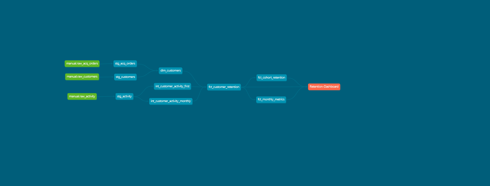

# Manual AE - Customer Retention Analytics

A dbt-based analytics project for analyzing customer retention, cohort retention rates, and monthly metrics across geographic regions and business categories.

### DAG Visualization



## Project Overview

This project processes acquisition orders, customer demographics, and activity data to calculate:
- **Cohort Retention**: Track how cohorts retain over time
- **Customer Retention**: Month-over-month retention rates by customer
- **Monthly Metrics**: Comprehensive monthly KPIs including retention rate change, churn rate, growth rate, and acquisition rate

The project is built with:
- **dbt** (v1.11+) — Data transformation and testing
- **BigQuery** — Data warehouse
- **DuckDB** (v1.4.4+) — Optional local development/testing
- **Python 3.12+** — Orchestration support

## Directory Structure

```
manual-ae/
├── manual_retention/              # dbt project root
│   ├── models/
│   │   ├── staging/               # Raw data models (sources)
│   │   │   ├── stg_acq_orders.sql
│   │   │   ├── stg_activity.sql
│   │   │   ├── stg_customers.sql
│   │   │   └── sources.yml
│   │   ├── intermediate/          # Intermediate calculations
│   │   │   ├── int_customer_activity_first.sql
│   │   │   └── int_customer_activity_monthly.sql
│   │   ├── marts/                 # Final business models
│   │   │   ├── fct_cohort_retention.sql
│   │   │   ├── fct_customer_retention.sql
│   │   │   └── fct_monthly_metrics.sql
│   │   └── dim/                   # Dimension tables
│   │       └── dim_customers.sql
│   ├── seeds/                     # Reference data
│   │   ├── customer_country.csv
│   │   └── taxonomy_business_category.csv
│   ├── tests/                     # Data quality tests
│   └── dbt_project.yml
├── data/                          # Raw data files
│   ├── acq_orders.csv
│   ├── activity.csv
│   ├── customers.csv
│   └── result.csv
├── notebooks/                     # Jupyter notebooks for EDA
│   └── eda.ipynb
├── main.py                        # Python entry point
├── pyproject.toml                 # Project dependencies
└── README.md                      # This file
```

## Data Models

### Staging Layer
- **stg_acq_orders** — Cleaned acquisition orders data
- **stg_activity** — Cleaned monthly activity records
- **stg_customers** — Cleaned customer master data with country and business category mappings

### Intermediate Layer
- **int_customer_activity_first** — First observed activity month per customer
- **int_customer_activity_monthly** — Monthly activity aggregates per customer

### Marts Layer
- **fct_cohort_retention** — Cohort-based retention analysis (by acquisition month)
  - Cohort size, retention metrics, and activity flags per month
  
- **fct_customer_retention** — Customer-level retention flags
  - Monthly activity indicators, retention status, reactivation flags
  - Dimensions: `customer_id`, `activity_month`, `customer_country`, `business_group`

- **fct_monthly_metrics** — Monthly KPIs aggregated by country and business group
  - **Metrics**: Active customers, new customers, retained customers, reactivated customers, churned customers
  - **Rates**: Retention rate, churn rate, growth rate, acquisition rate, **retention_rate_mom_change** (month-over-month change)

### Dimension Layer
- **dim_customers** — Customer master with conformed dimensions

## Key Features

### Retention Rate MoM Change
The `fct_monthly_metrics` table includes `retention_rate_mom_change` — the month-over-month difference in retention rate, calculated using window functions:
```sql
retention_rate - previous_month_retention_rate as retention_rate_mom_change
```

Perfect for time-series analysis in Looker or other BI tools to track retention trends.

## Getting Started

### Prerequisites
- Python 3.12+
- [uv](https://docs.astral.sh/uv/) (fast package installer)
- dbt 1.11+
- BigQuery account (or DuckDB for local development)

### Installation

1. **Clone and setup environment with uv**
   ```bash
   cd c:\git\manual-ae
   uv venv
   .\.venv\Scripts\Activate.ps1  # Windows
   ```

2. **Install dependencies**
   ```bash
   uv pip install -e .
   ```

3. **Configure dbt profile**
   - Update `~/.dbt/profiles.yml` with your BigQuery credentials
   - Or set environment variables for authentication

### Running the Project

```bash
cd manual_retention

# Run all models
dbt run

# Run with specific selection
dbt run -s tag:daily

# Run tests
dbt test

# Generate documentation
dbt docs generate
dbt docs serve
```

## Data Lineage

```
Raw Sources (CSV)
  ├── acq_orders
  ├── activity
  └── customers

Staging Models
  ├── stg_acq_orders
  ├── stg_activity
  └── stg_customers

Intermediate Models
  ├── int_customer_activity_first
  └── int_customer_activity_monthly

Marts / Facts
  ├── fct_cohort_retention
  ├── fct_customer_retention
  └── fct_monthly_metrics

Dimensions
  └── dim_customers
```

## Analysis Capabilities

### Retention Analysis
Track customer retention cohorts from acquisition month forward, identifying:
- Cohort size and month-over-month retention %
- Reactivation rates
- Churn patterns by geography and business category

### Monthly KPI Tracking
Monitor monthly performance across regions:
- Active customer counts and trends
- New customer acquisition
- Retention and churn rates
- Month-over-month retention rate change (for trend analysis)

### Geographic & Business Segmentation
All metrics are segmented by:
- **customer_country** — Country of customer
- **business_group** — Business category (from `taxonomy_business_category` seed)

## BI Integration (Looker)

The `fct_monthly_metrics` table is optimized for BI visualization:

### Recommended Visualizations
- **Retention Rate Trend**: Line chart of `retention_rate` by `activity_month`
- **MoM Retention Change**: Line or bar chart of `retention_rate_mom_change` (positive = improving retention, negative = declining)
- **Dual-Axis Trends**: Show both retention rate and churn rate on same visualization
- **Geographic Heatmap**: Retention rate by `customer_country` and `activity_month`

### Example Looker Dimensions
- `activity_month` — Month dimension
- `customer_country` — Geographic segment
- `business_group` — Business category segment

### Example Looker Measures
- `active_customers` — COUNT(DISTINCT customer_id)
- `retention_rate` — percentages, 0-100%
- `retention_rate_mom_change` — percentage point change
- `churn_rate` — percentages, 0-100%

## Configuration

### BigQuery Partitioning & Clustering
The `fct_monthly_metrics` table is optimized with:
- **Partition**: `activity_month` (monthly)
- **Cluster**: `customer_country`, `business_group`

This enables efficient querying by time period and segments.

## Testing

Data quality tests are included in `tests/` and `models/schema.yml`:
- **Null checks** — Required fields are not null
- **Uniqueness** — Primary keys are unique
- **Relationships** — Foreign keys reference valid dimensions
- **Accepted values** — Category fields contain valid values

Run tests with:
```bash
dbt test
```

## Documentation

Generate dbt documentation and view the interactive DAG:
```bash
dbt docs generate
dbt docs serve
```

Open `http://localhost:8000` to explore models, columns, and lineage.

## Performance Notes

- Models use `safe_divide()` for null-safe division operations
- Aggregate queries filtered to exclude first month (where `previous_month_active is null`)
- Partitioning and clustering on fact tables optimize BigQuery costs
- Use DuckDB for local development to test queries without BigQuery costs

## Future Enhancements

- [ ] Automated scheduling via dbt Cloud or Airflow
- [ ] Predictive churn modeling
- [ ] Customer lifetime value (CLV) calculations
- [ ] Segment-level cohort analysis
- [ ] Real-time reactivation alerting

## Support & Resources

- [dbt Documentation](https://docs.getdbt.com/)
- [BigQuery SQL Reference](https://cloud.google.com/bigquery/docs/reference/standard-sql/query-syntax)
- Project-specific questions: See `manual_retention/README.md`

## Project Status

- **Last Updated**: February 2026
- **Version**: 1.0.0
- **Status**: Active Development
